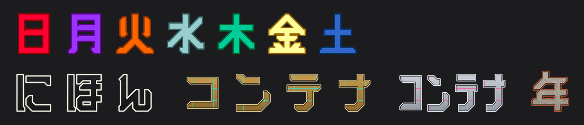
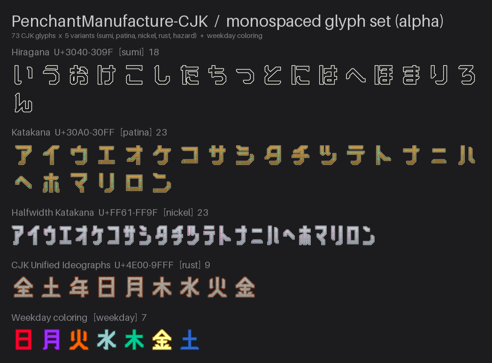

# PenchantManufacture-CJK



**RadianN_kswg / ラジアン（柏木主税）による独自フォント PenchantManufacture** の
**等幅・CJK（かな／カタカナ／漢字）対応版** を制作するリポジトリです。
本家 [PenchantManufacture_ImageAssets](https://github.com/radiann-kswg/PenchantManufacture_ImageAssets)
をサブモジュール `.EN-original/` として取り込み、その設計思想・命名規則・ビルドフロー・
工業デカール作風をそのまま継承しつつ、**半角 7.5mm／全角 15.0mm の等幅グリフ**を追加します。

想定用途は **ターミナルアプリ等へのソフトウェア埋め込み**（等幅フォント）と、
本家同様の **SNS カスタム絵文字**（Discord・Misskey）です。

> **著作権者**: RadianN_kswg / ラジアン（柏木主税）
> **ライセンス**: [CC BY 4.0](https://creativecommons.org/licenses/by/4.0/deed.ja)（本家と同一・由来を問わず一律）
> **状態**: **alpha**。収録字は五十音の一部にとどまり、収録字・グリフ形状・メトリクス以外の仕様は
> 予告なく変わることがあります。等幅枠（496u / 992u）・縦メトリクス・フォント名は確定契約として固定です。
> **リポジトリ**: `radiann-kswg/PenchantManufacture_ImageAssets-CJK`（2026-09-14 に
> `PenchantManufacture-CJK` から改称。**製品名・フォント名・ローカルの作業フォルダ名は従来どおり**）

### 等幅フォント（OTF）

`dist/fonts/PenchantManufactureCJKMono-Regular.otf` — family **PenchantManufacture CJK Mono**、
半角 496u／全角 992u の等幅 OpenType（CFF）フォント。欧文 409 字（本家の字形をそのまま複製）と
CJK 73 字、`space`（半角）・U+3000（全角）を収録し、ターミナルでは半角 2 文字＝全角 1 文字に揃います。
ローマ数字 Ⅲ〜ⅻ は全角なので、ターミナルの **East Asian Ambiguous width を「wide」** に設定して使います。

### 収録グリフ一覧（工業デカール）

かな・カタカナ・半角カタカナ・漢字を、本家と同じ 5 種の工業デカール
（sumi / patina / nickel / rust / hazard）で収録し、曜日漢字 7 字には
専用の曜日配色バリアント `weekday` を加えています。



---

## 収録グリフ

CJK グリフは Illustrator 原本（`_original-fonts/.develop/f-skt penchant-manufactuer-cjk_v4.alpha1.ai`）
のアートボードから抽出します。欧文 409 字は本家 OTF（v4.0-release）から
**等幅枠へ再配置**して同梱します。

| カテゴリ         | 内容                                                              | 字数 | 枠   |
| ---------------- | ----------------------------------------------------------------- | ---- | ---- |
| ひらがな         | い う お け こ し た ち つ と に は へ ほ ま り ろ ん               | 18   | 全角 |
| カタカナ         | ア イ ウ エ オ ケ コ サ シ タ チ ツ テ ト ナ ニ ハ ヘ ホ マ リ ロ ン | 23   | 全角 |
| 半角カタカナ     | ｱ ｲ ｳ ｴ ｵ ｹ ｺ ｻ ｼ ﾀ ﾁ ﾂ ﾃ ﾄ ﾅ ﾆ ﾊ ﾍ ﾎ ﾏ ﾘ ﾛ ﾝ（U+FF71〜）          | 23   | 半角 |
| 漢字             | 日 月 火 水 木 金 土（曜日）／ 全 年                                | 9    | 全角 |
| 欧文（本家由来） | ASCII・ラテン拡張・ギリシャ・キリル・数学記号・ローマ数字ほか        | 409  | 半角（ローマ数字 Ⅲ〜ⅻ の 16 字のみ全角） |

濁点・半濁点・や行・小書き（ぁ ゃ など）・和文括弧／約物は未収録です
（計画は [docs/GLYPH_EXTENSION_PLAN.md](docs/GLYPH_EXTENSION_PLAN.md)）。

### 収録スコープ（7 カテゴリ）

カスタム絵文字用のグリフは、次の 7 カテゴリのいずれかに分類できる字だけを収録します
（[AGENTS.md](AGENTS.md)「収録スコープ」が正。実装は `scripts/extract_ai_glyphs.py` の
`SCOPE_SYMBOL` / `SCOPE_KANJI` / `scope_of()`）。

| # | カテゴリ | 収録する字 |
| --- | --- | --- |
| 1 | 平仮名 | U+3041–U+309F（五十音・濁点／半濁点・小書きなど） |
| 2 | 片仮名 | U+30A0–U+30FF ／ 半角 U+FF66–U+FF9F |
| 3 | 記号 | 和文括弧・約物 `「」『』【】〈〉《》〔〕、。・〜々` |
| 4 | 漢数字 | `〇一二三四五六七八九十百千万億兆` ＋ 大字・異体 `零壱弐弍参肆伍陸漆捌玖拾佰仟萬爾` |
| 5 | カレンダー用漢字 | `日月火水木金土年全祝春夏秋冬閏` |
| 6 | 干支 | `子丑寅卯辰巳午未申酉戌亥` ＋ `甲乙丙丁戊己庚辛壬癸` |
| 7 | 方角 | `東西南北天地中` |

欧文 409 字は本家由来の別系統のため、このスコープの対象外です。
8 個目以降のカテゴリ（麻雀牌・将棋駒・元号ほか）の候補は
[docs/GLYPH_EXTENSION_PLAN.md](docs/GLYPH_EXTENSION_PLAN.md) §4-3 に未確定案として挙げています。

### 等幅メトリクス契約

| 項目     | 値                                                         |
| -------- | ---------------------------------------------------------- |
| 単位     | 1mm = 66.1u（capHeight 661u ＝ 欧文原本の大文字高 10mm）    |
| 半角枠   | **496u**（7.50mm）                                          |
| 全角枠   | **992u**（15.01mm）＝ 半角 × 2                              |
| 縦帯     | 本家 OS/2 win 帯 **[−198, 793]**（991u）をそのまま継承       |
| かな箱   | 上端 = capHeight 661u（行上端）、下端はインク高に従う（12〜13mm） |

欧文の半角／全角判定は **インク幅**（≤ 496u → 半角）で行い、枠内では advance 箱を中央に置きます
（`m w 4 # &` など advance が枠を僅かに超える字はインク中央）。
詳細は [AGENTS.md](AGENTS.md)「等幅メトリクス契約」を参照してください。

---

## ディレクトリ構成

```
PenchantManufacture-CJK/
├── .EN-original/                     # 【サブモジュール】本家 PenchantManufacture_ImageAssets（読み取り専用）
├── src/
│   └── glyphs/                       # 等幅グリフ SVG（欧文 409 ＋ CJK 73、512 正方・配置フレーム付き）
├── dist/
│   ├── fonts/                        # 等幅 OTF: PenchantManufactureCJKMono-Regular.otf（build_font.py が生成）
│   ├── glyphs_decal/{variant}/       # CJK 工業デカール 幅可変PNG（Misskey向け・マスター）
│   └── glyphs_decal_square/{variant}/ # CJK 工業デカール 正方形PNG（Discord向け）
├── scripts/
│   ├── build_cjk.py                  # 一括ビルド（latin → cjk → font → decal → weekday → previews）
│   ├── build_font.py                 # 等幅 OTF の生成と検証（本家 CFF 複製 ＋ CJK SVG → skia-pathops）
│   ├── metrics.py                    # 等幅メトリクス契約の定数（SVG 抽出と OTF 生成が共用）
│   ├── extract_ai_glyphs.py          # Illustrator 原本 → 等幅 SVG（五十音グリッド GRID が SSOT）
│   ├── build_previews_cjk.py         # README 用プレビュー画像
│   ├── extract_dice_dxf.py           # 旧経路: Fusion 360 f3d → DXF（代替・温存）
│   └── fusion/                       # 旧経路: Fusion 360 用スクリプト（代替・温存）
├── assets/                           # 旧経路の f3d / DXF（代替・温存）
├── docs/
│   ├── previews/                     # hero.png / glyphset.png（ビルドが自動生成）
│   ├── HANDOFF_PHASE2.md             # フェーズ2（等幅 OTF 化）への引継ぎ資料
│   ├── GLYPH_EXTENSION_PLAN.md       # 和文括弧・約物の制作計画
│   ├── WEEKDAY_COLORING_PLAN.md      # 曜日配色（weekday バリアントの正）
│   └── glyph_aliases.json            # 本家 extract の生成物（自動生成）
├── _original-fonts/                  # 原本 OTF / .ai（読み取り専用・.gitignore対象）
├── _exported-dist/                   # エクスポート zip 格納（.gitignore対象）
├── requirements.txt
├── LICENSE                           # CC BY 4.0
├── AGENTS.md                         # エージェント共通指示書（CJK 固有差分の SSOT）
└── CLAUDE.md                         # Claude 向け入口（@AGENTS.md）
```

variant = `sumi`（墨・**既定**／二画面）/ `rust`（酸鉄）/ `hazard`（警戒）/ `patina`（緑青真鍮）/
`nickel`（白銅燐光）＋ CJK 専用 `weekday`（曜日配色・日〜土のみ）

---

## セットアップ

### 必要環境

- Python 3.11+（Windows では `py -3.14`、macOS では Python 3.14 の venv を使用）
- 依存ライブラリ（`requirements.txt`。本家の依存を `-r` で取り込み＋ PyMuPDF ＋ skia-pathops）
- サブモジュール `.EN-original/` の取得

```bash
git submodule update --init
py -3.14 -m pip install -r requirements.txt
```

Windows で本家デカール生成（cairosvg）が `no library called "cairo-2"` で止まる場合は、
手元にある libcairo の DLL ディレクトリを環境変数で渡します（例: KiCad 同梱の `cairo-2.dll`）。

```powershell
$env:CAIRO_DLL_DIR = "C:\Program Files\KiCad\10.0\bin"
```

macOS（Homebrew）では libcairo を Homebrew で入れ、venv に依存を導入します。
Homebrew の `/opt/homebrew/lib` は既定のライブラリ探索先に無いため、環境変数で渡します。

```bash
brew install cairo
python3 -m venv ../.venv                                # 例: ImageAssets 直下に共有 venv
../.venv/bin/python -m pip install -r requirements.txt
export DYLD_FALLBACK_LIBRARY_PATH=/opt/homebrew/lib
```

### グリフアセットの生成

以下のコマンド例は Windows 表記です。macOS では `py -3.14` を venv の `python`（例: `../.venv/bin/python`）に読み替えます。

```bash
# 全ステップ一括: 欧文 OTF → 等幅 SVG、.ai → CJK SVG、等幅 OTF、CJK デカール PNG、曜日配色、プレビュー
py -3.14 scripts/build_cjk.py

# SVG と等幅 OTF だけ更新（PNG を生成しない）
py -3.14 scripts/build_cjk.py --no-decal

# 等幅 OTF だけ生成・検証（libcairo 不要）／ TTF も出力
py -3.14 scripts/build_font.py
py -3.14 scripts/build_font.py --ttf

# .ai の抽出だけ対象確認
py -3.14 scripts/extract_ai_glyphs.py --dry-run
```

原本（`_original-fonts/`）は `.gitignore` 対象のため、ビルドは原本を持つ環境でのみ再現できます。
生成物（`src/glyphs/` `dist/` `docs/previews/`）はコミットに含めています。
OTF は `head` の日時を固定しているので、字形を変えなければ再ビルドしてもバイト一致します。

### SNS カスタム絵文字の登録

- **Misskey**: `dist/glyphs_decal/{variant}/*_128.png`（幅可変。半角カナは半角幅、かな・漢字は全角幅）
- **Discord**: `dist/glyphs_decal_square/{variant}/*_128.png`（正方形スロット向け）

Misskey 一括インポート zip・文字列コンバーター（aiscript）の対応表は未整備です
（本家 `glyph_tokens` 方式に倣って登録段階で追加予定）。

---

## 出力仕様

| 項目                | 仕様                                                          |
| ------------------- | ------------------------------------------------------------- |
| 等幅 OTF            | OpenType/CFF、unitsPerEm 1000、advance 496u / 992u、hhea・typo 660/−400、win 793/198、`post.isFixedPitch=1`、PANOSE proportion=monospaced、kern なし |
| グリフ SVG          | viewBox `0 0 512 512`、`<!-- frame x=.. y=.. -->` に等幅枠を埋め込み |
| CJK SVG の塗り      | `fill-rule="evenodd"`（原本の周り方に依存せず穴を再現）        |
| デカール（Misskey） | 高さ 512 / 128 px・**幅可変**（半角 ≈ 1:2、全角 ≈ 1:1）        |
| デカール（Discord） | 512 / 128 px の**正方形**（中央寄せパディング）                |
| 背景／色            | 透過（alpha）／ sRGB                                          |

ファイル命名: かな・カタカナ・漢字は AGL 名を持たないため `char_uniXXXX_XXXX.svg`
（例: `char_uni3044_3044.svg` = い、`char_uniFF71_FF71.svg` = ｱ）。欧文は本家と同じ
`char_{AGL名}_{コードポイント}.svg`。

---

## ロードマップ

1. **フェーズ1（完了・alpha）** — 等幅グリフ SVG と CJK 工業デカール PNG の生成環境
2. **フェーズ2（完了・v0.1.0）** — 等幅 OTF の生成環境（`scripts/build_font.py`）。
   経緯と設計判断: [docs/HANDOFF_PHASE2.md](docs/HANDOFF_PHASE2.md)
3. 収録字の拡充（濁点・半濁点・や行・小書き・和文括弧／約物）、Misskey zip・aiscript 対応表

---

## クレジット

### フォント

**PenchantManufacture** — RadianN_kswg / ラジアン（柏木主税）による独自作字フォント。
CJK グリフも同作者が Illustrator 上で作字しています。

### 生成ツール

**Claude（Anthropic）** — Agent 機能を使用してアセットの設計・スクリプト生成を行っています。
本プロジェクトの制作は Claude Cowork による自律エージェント作業によって実施されました。

---

## ライセンス

本リポジトリの成果物（本家由来の欧文部分・新規制作の CJK 部分・スクリプト）は
由来を問わず **CC BY 4.0** で公開します。フォントのアプリケーション・ドキュメント・Web への
埋め込みを許諾します（CC BY はコピーレフトではないため埋め込み先へライセンスは伝播しませんが、
著作者クレジットとライセンスへのリンクの表記義務は維持されます）。

**[Creative Commons 表示 4.0 国際](https://creativecommons.org/licenses/by/4.0/deed.ja)** — 詳細は [LICENSE](LICENSE)

著作者：RadianN_kswg / ラジアン（柏木主税）

利用時のクレジット表記例:

```
PenchantManufacture-CJK by RadianN_kswg / ラジアン（柏木主税）
CC BY 4.0 https://creativecommons.org/licenses/by/4.0/
```
